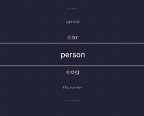

# Haptic Wheel Picker
React native wheel picker for Android/IOS with haptic feedback and handles like a flatlist.


  


## Installation
`
npm install @axenuab/react-native-haptic-wheel-picker
`

## Usage
The component takes a list of data and displays it as a text per default.

```js
import Picker from '@axenuab/react-native-haptic-wheel-picker'

return (
  <View>
    <Picker
      data={['list', 'grid', 'car', 'person', 'cog', 'flower', 'boat']}
    />
  </View>
);
```

You can send in any generic data and a custom render function to handle the displaying yourself.

```js
import Picker from '@axenuab/react-native-haptic-wheel-picker'

const [image, setImage] = useState(image1);

const renderImage = (imageSource) => {
  return (
    <Image
      source={imageSource}
    />
  );
};

return (
  <View>
    <Picker
      data={[image1, image2, image3, image4, image5]}
      defaultItem={image}
      onItemSelect={setImage}
      renderItem={renderImage}
    />
  </View>
);
```
## Props
Component takes generic type T from items in data.
| Prop  | Default  | Type | Description |
| :------------ |:---------------:| :---------------:| :-----|
| data | - | T[] | List of items that are selected |
| defaultItem | data[0] | T | The currently selected item |
| onItemSelect | undefined | function | Callback function when an item is selected |
| textStyle | undefined | TextStyle | Style of text for default rendering |
| renderItem | undefined | function | Custom render function for item |
| keyExtractor | undefined | function | Custom key extractor function |
| itemHeight | 40 | number | The height of items |
| itemDistanceMultipier | 0.285 | number | Multiplier for distance between items|
| wheelHeightMultiplier | 2.6 | number | Multiplier for wheel height |
| selectorStyle | undefined | ViewStyle | Style for view of selecting item |
